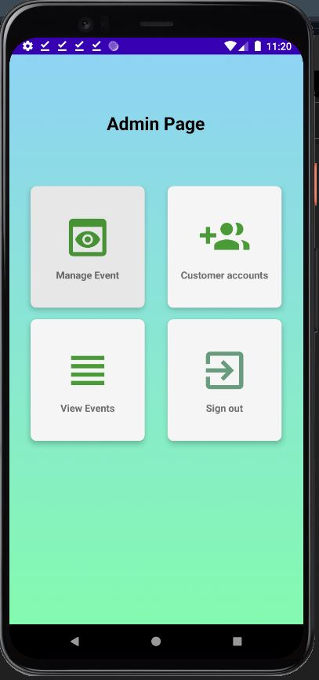
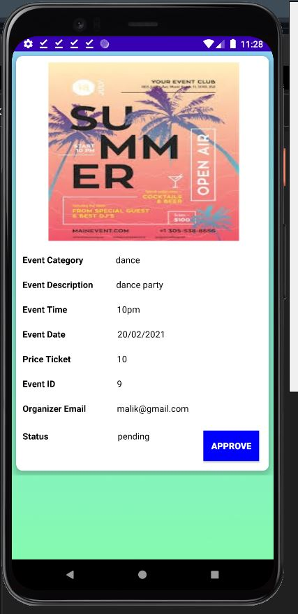
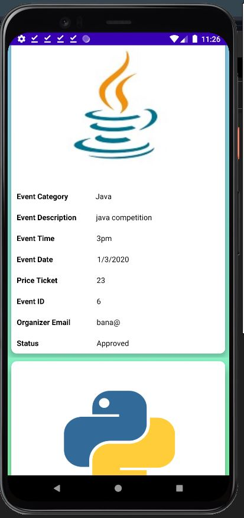
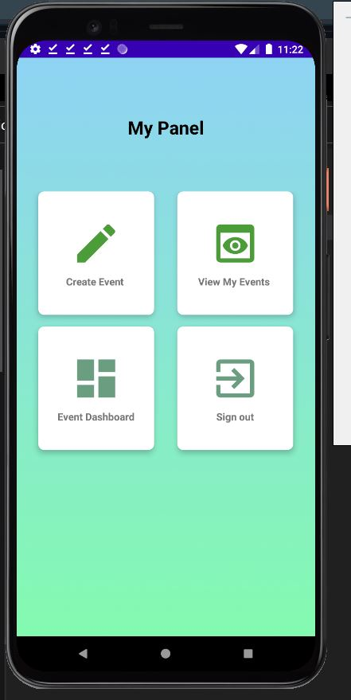
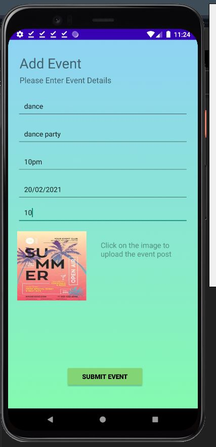
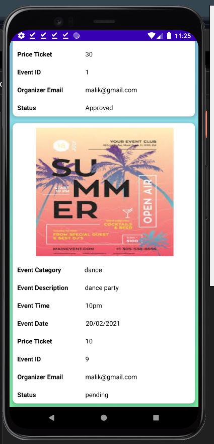
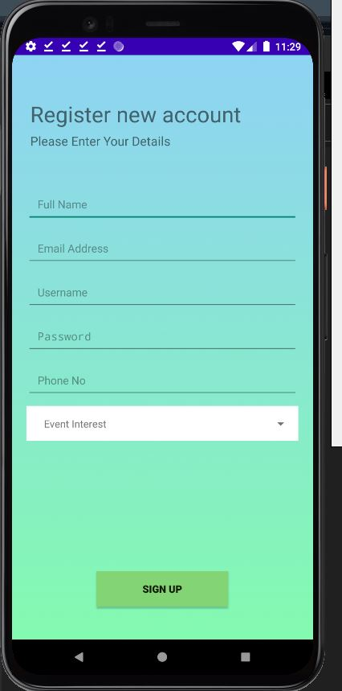

# EventManagementSystem
...............................EventManagementSystem...................................
EventManagementSystem is an event management mobile application which allow the both sides of users to manage the events. 
The app designed for the admin side (can be the organization who own the system) and the customer side(can be the normal user of the service) as well.
The app designed with many features to achieve good GUI and functionality. Furthermore, the app designed using Java langage and Firebase cloud service. 

App features: 
1. The app implemented with Firebase cloud service.
2. The app implmented with authentication.
3. The app designed for to type of users.

Firebase service used: 
  1. authentaction: to create the admin account
  2. database: to store the accounts and events details
  3. storage: to upload event images

App funcationality:
1. Login Page for both users

2. Admin user:
   a. admin dashboard
    
   
   b. manage event
     
    
    
   c. customer accounts
     
    
    
   d. view all events
    

3. Customer user:
   a. customer dahsboard
     
    
    
   b. add event
     
    
    
   c. view my events
     
    
    
   d. event dahsboard 
     
    
    e. sign up
     
 
 
App future enhancements:
  1. add all the missing features
  2. improve the authentation
  3. improve the GUI
  4. add recoomendation engine
  5. add offline mode 
  
    
    
    
    
